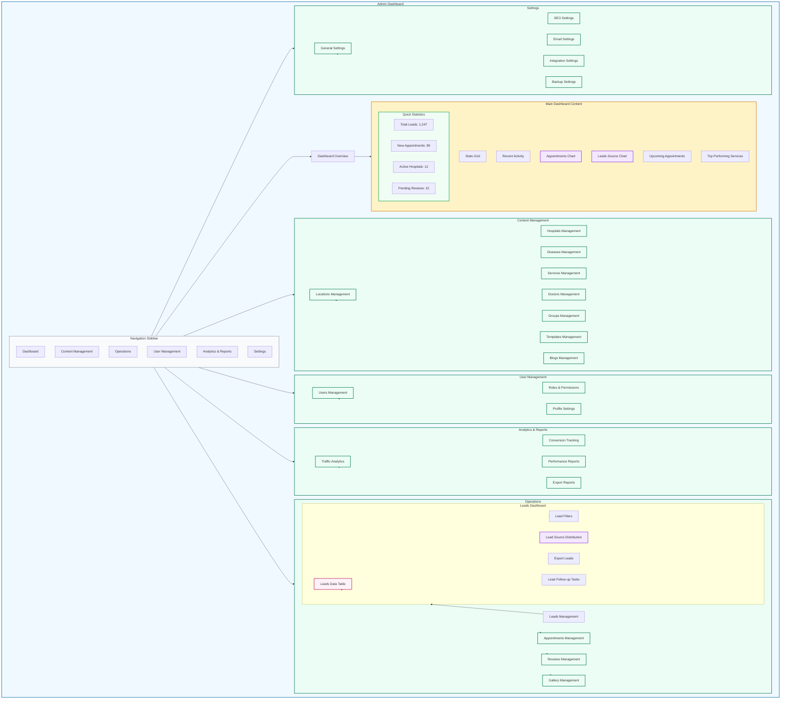
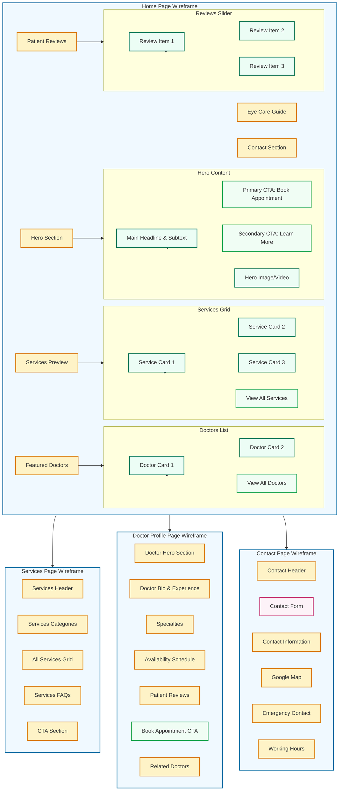
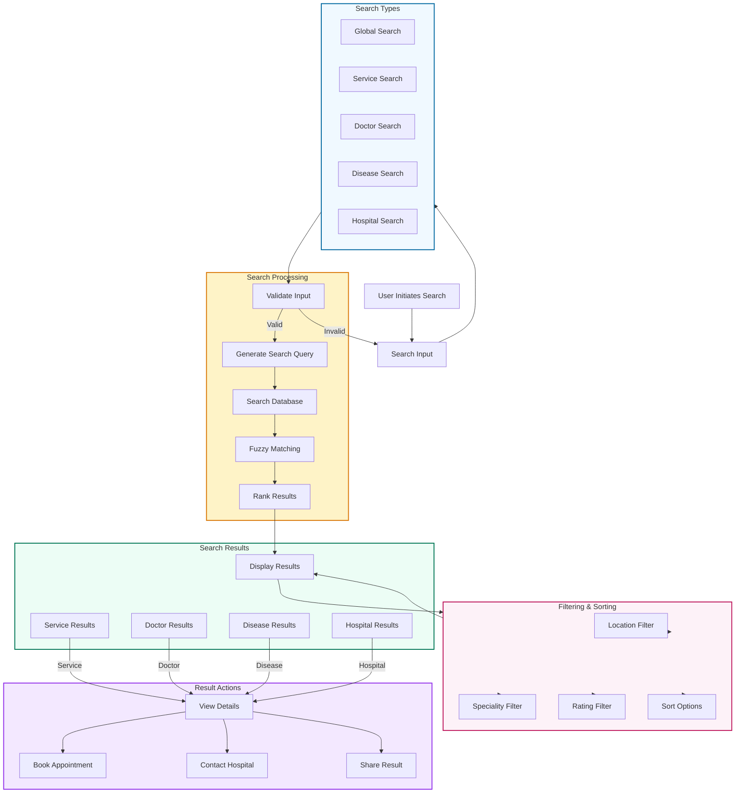

# Blik_eye Project - Detailed Interactive Flowcharts and Wireframes

## 5. User Journey Flowchart (Patient from Landing to Appointment)

```mermaid
flowchart TD
    Start[Patient Lands on Website]
    HomePage[Home Page]
    
    subgraph NavigationOptions [Navigation Options]
        Nav1[Explore Services]
        Nav2[Find Doctors]
        Nav3[Search Diseases]
        Nav4[Book Appointment]
        Nav5[Contact Us]
    end
    
    subgraph ServicePath [Service Exploration Path]
        ServicesPage[Services Page]
        ServiceDetails[Service Details Page]
        ServiceFAQ[View FAQs]
        ServiceReviews[View Patient Reviews]
        ServiceLead[Capture Lead - Service Interest]
    end
    
    subgraph DoctorPath [Doctor Exploration Path]
        DoctorsPage[Doctors Page]
        DoctorProfile[Doctor Profile Page]
        DoctorSchedule[View Doctor Schedule]
        DoctorReviews[View Doctor Reviews]
        DoctorLead[Capture Lead - Doctor Interest]
    end
    
    subgraph DiseasePath [Disease Information Path]
        DiseasesPage[Diseases Page]
        DiseaseDetails[Disease Details Page]
        DiseaseSymptoms[View Symptoms]
        DiseaseTreatment[View Treatment Options]
        DiseasePrevention[View Prevention]
        DiseaseLead[Capture Lead - Disease Consultation]
    end
    
    subgraph AppointmentPath [Appointment Booking Path]
        AppointmentPage[Appointment Booking Page]
        SelectHospital[Select Hospital Location]
        SelectDoctor[Select Doctor]
        SelectDateTime[Select Date & Time]
        PatientDetails[Fill Patient Details Form]
        ConfirmBooking[Confirm & Submit Booking]
        BookingSuccess[Booking Success - Confirmation Email/SMS]
        AdminNotification[Admin Dashboard Notification]
        CalendarSync[Sync with Hospital Calendar]
    end
    
    subgraph SearchPath [Search & Navigation]
        SearchBar[Global Search]
        SearchResults[Search Results Page]
        FilterResults[Filter by Location/Doctor/Service]
    end
    
    Start --> HomePage
    
    HomePage -->|Navigation| Nav1
    HomePage -->|Navigation| Nav2
    HomePage -->|Navigation| Nav3
    HomePage -->|Navigation| Nav4
    HomePage -->|Navigation| Nav5
    
    HomePage -->|Search| SearchBar
    SearchBar --> SearchResults
    SearchResults --> FilterResults
    FilterResults -->|Select Service| ServiceDetails
    FilterResults -->|Select Doctor| DoctorProfile
    FilterResults -->|Select Disease| DiseaseDetails
    
    Nav1 --> ServicesPage
    ServicesPage --> ServiceDetails
    ServiceDetails --> ServiceFAQ
    ServiceDetails --> ServiceReviews
    ServiceDetails --> ServiceLead
    ServiceDetails -->|Book Appointment| AppointmentPage
    
    Nav2 --> DoctorsPage
    DoctorsPage --> DoctorProfile
    DoctorProfile --> DoctorSchedule
    DoctorProfile --> DoctorReviews
    DoctorProfile --> DoctorLead
    DoctorProfile -->|Book Appointment| AppointmentPage
    
    Nav3 --> DiseasesPage
    DiseasesPage --> DiseaseDetails
    DiseaseDetails --> DiseaseSymptoms
    DiseaseDetails --> DiseaseTreatment
    DiseaseDetails --> DiseasePrevention
    DiseaseDetails --> DiseaseLead
    DiseaseDetails -->|Book Appointment| AppointmentPage
    
    Nav4 --> AppointmentPage
    
    AppointmentPage --> SelectHospital
    SelectHospital --> SelectDoctor
    SelectDoctor --> SelectDateTime
    SelectDateTime --> PatientDetails
    PatientDetails --> ConfirmBooking
    ConfirmBooking --> BookingSuccess
    ConfirmBooking --> AdminNotification
    ConfirmBooking --> CalendarSync
    
    classDef homePage fill:#f0f9ff,stroke:#0369a1,stroke-width:2px
    classDef navOption fill:#fef3c7,stroke:#d97706,stroke-width:2px
    classDef pathNode fill:#ecfdf5,stroke:#047857,stroke-width:2px
    classDef formNode fill:#fdf2f8,stroke:#be185d,stroke-width:2px
    classDef successNode fill:#f0fdf4,stroke:#16a34a,stroke-width:2px
    classDef adminNode fill:#fef9c3,stroke:#f59e0b,stroke-width:2px
    
    class HomePage homePage
    class Nav1,Nav2,Nav3,Nav4,Nav5 navOption
    class ServicesPage,ServiceDetails,ServiceFAQ,ServiceReviews,DoctorsPage,DoctorProfile,DoctorSchedule,DoctorReviews,DiseasesPage,DiseaseDetails,DiseaseSymptoms,DiseaseTreatment,DiseasePrevention pathNode
    class ServiceLead,DoctorLead,DiseaseLead,PatientDetails,ConfirmBooking formNode
    class BookingSuccess successNode
    class AdminNotification,CalendarSync adminNode
```



## 6. Admin Dashboard Wireframe (High-Fidelity)



## 7. Frontend Page Wireframes (Detailed)



## 8. Feature-Specific Flowcharts

### 8.1 Lead Generation Flowchart

```mermaid
flowchart TD
    Start[Lead Capture Trigger]
    
    subgraph LeadSources [Lead Sources]
        ServicePage[Service Page]
        DoctorPage[Doctor Page]
        DiseasePage[Disease Page]
        HomePageCTA[Home Page CTA]
        SearchResults[Search Results]
        ContactPage[Contact Page]
    end
    
    subgraph CaptureMethods [Capture Methods]
        InlineForm[Inline Lead Form]
        PopupForm[Popup Form]
        ModalForm[Modal Form]
        ContactForm[Contact Form]
    end
    
    subgraph FormFields [Form Fields]
        NameInput[Name]
        PhoneInput[Phone Number]
        EmailInput[Email (Optional)]
        ReasonSelect[Reason for Interest]
        LocationSelect[Location]
        PreferredDate[Preferred Date]
        Notes[Notes (Optional)]
    end
    
    subgraph Validation [Validation & Processing]
        ValidateInputs[Validate Inputs]
        CheckDuplicate[Check for Duplicate Lead]
        SaveLead[Save Lead to Database]
        AssignHospital[Assign to Hospital]
        SendNotifications[Send Notifications]
    end
    
    subgraph Notifications [Notifications]
        EmailNotification[Email to Admin]
        SMSNotification[SMS to Admin]
        PatientConfirmation[Patient Confirmation Email/SMS]
    end
    
    subgraph FollowUp [Follow-up Process]
        AdminDashboard[Admin Dashboard Notification]
        LeadDashboard[Lead Management Dashboard]
        FollowUpTask[Create Follow-up Task]
        LeadStatus[Set Lead Status]
    end
    
    Start --> LeadSources
    LeadSources --> CaptureMethods
    
    ServicePage --> InlineForm
    DoctorPage --> InlineForm
    DiseasePage --> InlineForm
    HomePageCTA --> ModalForm
    SearchResults --> ModalForm
    ContactPage --> ContactForm
    
    CaptureMethods --> FormFields
    FormFields --> ValidateInputs
    ValidateInputs -->|Valid| CheckDuplicate
    ValidateInputs -->|Invalid| FormFields
    
    CheckDuplicate -->|New Lead| SaveLead
    CheckDuplicate -->|Existing Lead| UpdateLead[Update Existing Lead]
    
    SaveLead --> AssignHospital
    UpdateLead --> AssignHospital
    
    AssignHospital --> SendNotifications
    SendNotifications --> Notifications
    SendNotifications --> FollowUp
    
    Notifications --> EmailNotification
    Notifications --> SMSNotification
    Notifications --> PatientConfirmation
    
    FollowUp --> AdminDashboard
    FollowUp --> LeadDashboard
    FollowUp --> FollowUpTask
    FollowUp --> LeadStatus
    
    classDef source fill:#f0f9ff,stroke:#0369a1,stroke-width:2px
    classDef capture fill:#fef3c7,stroke:#d97706,stroke-width:2px
    classDef form fill:#ecfdf5,stroke:#047857,stroke-width:2px
    classDef process fill:#fdf2f8,stroke:#be185d,stroke-width:2px
    classDef notification fill:#f3e8ff,stroke:#9333ea,stroke-width:2px
    classDef followup fill:#f0fdf4,stroke:#16a34a,stroke-width:2px
    
    class LeadSources source
    class CaptureMethods capture
    class FormFields form
    class Validation process
    class Notifications notification
    class FollowUp followup
```

### 8.2 Search Functionality Flowchart



### 8.3 Appointment Booking Flowchart

```mermaid
flowchart TD
    Start[Start Appointment Booking]
    SelectHospital[Select Hospital Location]
    
    subgraph HospitalSelection [Hospital Information]
        HospitalList[Hospital List]
        HospitalDetails[Hospital Details]
        HospitalServices[Hospital Services]
        HospitalReviews[Hospital Reviews]
    end
    
    subgraph DoctorSelection [Doctor Selection]
        DoctorList[Available Doctors]
        DoctorProfile[Doctor Profile]
        DoctorAvailability[Doctor Availability]
    end
    
    subgraph DateSelection [Date & Time Selection]
        CalendarView[Calendar View]
        TimeSlots[Available Time Slots]
        SlotSelection[Select Time Slot]
    end
    
    subgraph PatientDetails [Patient Information]
        PatientForm[Patient Form]
        PatientName[Full Name]
        PatientPhone[Phone Number]
        PatientEmail[Email]
        PatientAge[Age]
        PatientGender[Gender]
        AppointmentReason[Appointment Reason]
        MedicalHistory[Medical History]
    end
    
    subgraph Confirmation [Booking Confirmation]
        BookingSummary[Booking Summary]
        TermsConditions[Terms & Conditions]
        ConfirmButton[Confirm Booking]
        PaymentSection[Payment Section (Optional)]
    end
    
    subgraph Success [Booking Success]
        SuccessPage[Success Page]
        ConfirmationEmail[Confirmation Email]
        ConfirmationSMS[Confirmation SMS]
        CalendarSync[Calendar Sync]
        AdminNotification[Admin Notification]
    end
    
    subgraph RescheduleCancel [Reschedule/Cancel]
        ViewBooking[View Booking]
        Reschedule[Reschedule]
        Cancel[Cancel]
        ReasonInput[Reason for Change]
    end
    
    Start --> SelectHospital
    SelectHospital --> HospitalSelection
    HospitalSelection --> HospitalList
    HospitalList --> HospitalDetails
    HospitalDetails --> DoctorSelection
    DoctorSelection --> DoctorList
    DoctorList --> DoctorProfile
    DoctorProfile --> DoctorAvailability
    DoctorAvailability --> DateSelection
    DateSelection --> CalendarView
    CalendarView --> TimeSlots
    TimeSlots --> SlotSelection
    SlotSelection --> PatientDetails
    PatientDetails --> PatientForm
    PatientForm --> PatientName
    PatientForm --> PatientPhone
    PatientForm --> PatientEmail
    PatientForm --> PatientAge
    PatientForm --> PatientGender
    PatientForm --> AppointmentReason
    PatientForm --> MedicalHistory
    PatientDetails --> Confirmation
    Confirmation --> BookingSummary
    BookingSummary --> TermsConditions
    TermsConditions --> ConfirmButton
    ConfirmButton --> Success
    Success --> SuccessPage
    SuccessPage --> ConfirmationEmail
    SuccessPage --> ConfirmationSMS
    SuccessPage --> CalendarSync
    SuccessPage --> AdminNotification
    
    Success --> RescheduleCancel
    RescheduleCancel --> ViewBooking
    ViewBooking --> Reschedule
    ViewBooking --> Cancel
    Reschedule --> DateSelection
    Cancel --> ReasonInput
    
    classDef selection fill:#f0f9ff,stroke:#0369a1,stroke-width:2px
    classDef form fill:#fef3c7,stroke:#d97706,stroke-width:2px
    classDef confirmation fill:#ecfdf5,stroke:#047857,stroke-width:2px
    classDef success fill:#fdf2f8,stroke:#be185d,stroke-width:2px
    classDef management fill:#f3e8ff,stroke:#9333ea,stroke-width:2px
    
    class SelectHospital,HospitalSelection,DoctorSelection,DateSelection selection
    class PatientDetails form
    class Confirmation confirmation
    class Success success
    class RescheduleCancel management
```

## Diagram Summary

### 5. User Journey Flowchart
- Detailed patient journey from landing to appointment booking
- Multiple navigation paths (services, doctors, diseases, search)
- Clear conversion points and lead capture opportunities
- Admin notification and calendar sync integration

### 6. Admin Dashboard Wireframe
- High-fidelity dashboard with detailed modules
- Content management, operations, user management, analytics, and settings
- Specific features like leads management, appointment tracking, and reports
- Visual hierarchy with stats, charts, tables, and management sections

### 7. Frontend Page Wireframes
- Detailed wireframes for key public pages
- Home page with hero section, services, doctors, reviews, and guide
- Services page with categories, grid, FAQs, and CTA
- Doctor profile page with bio, schedule, reviews, and booking options
- Contact page with form, map, and contact information

### 8. Feature-Specific Flowcharts
- **Lead Generation**: From source capture to follow-up process
- **Search Functionality**: Global and specific search types with filtering
- **Appointment Booking**: Complete booking process with reschedule/cancel functionality

All diagrams are created using Mermaid syntax for easy viewing and editing, following the project's architecture and requirements. They provide a comprehensive visual representation of the Blik_eye system, making it easier to understand and maintain.
