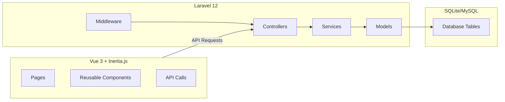
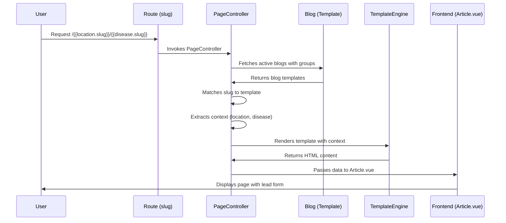
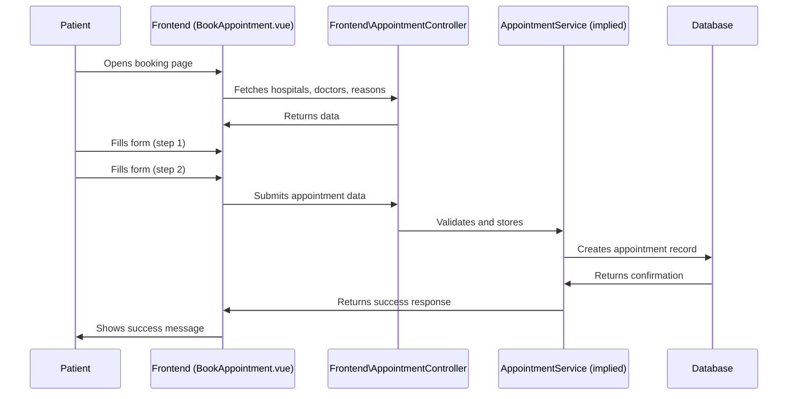

# Blik_eye Project Analysis

## 1. Project Overview

Blik_eye is a **healthcare/hospital management platform** specifically designed for eye care hospitals. The project is built using **Laravel 12** for the backend and **Vue 3 with Inertia.js** for the frontend, following a modern monorepo architecture.

The platform serves two main purposes:
- **Patient-facing frontend**: Provides information about eye diseases, services, and hospitals, with lead generation and appointment booking functionality
- **Admin dashboard**: Allows hospital managers and super admins to manage hospitals, doctors, services, diseases, locations, leads, appointments, and content templates

## 2. Database Structure

### Key Entities and Relationships

```mermaid
erDiagram
    USER {
        id PK
        name string
        email string
        phone string
        password string
        role string
        hospital_id int
    }
    
    HOSPITAL {
        id PK
        name string
        domain string
        subdomain string
        email string
        phone string
        location_id int
        lat decimal
        lng decimal
        image string
        is_active boolean
    }
    
    LOCATION {
        id PK
        parent_id int
        type string
        name string
        slug string
        lat decimal
        lng decimal
        pincode string
        population int
        seo_priority int
        is_active boolean
        image string
    }
    
    DISEASE {
        id PK
        name string
        slug string
        description text
        image string
        is_active boolean
    }
    
    SERVICE {
        id PK
        name string
        slug string
        description text
        image string
        is_active boolean
    }
    
    DOCTOR {
        id PK
        name string
        specialty string
        bio text
        hospital_id int
        image string
        slug string
        is_active boolean
    }
    
    LEAD {
        id PK
        hospital_id int
        disease_id int
        location_id int
        name string
        phone string
        source_url text
        campaign_type string
        status string
    }
    
    APPOINTMENT {
        id PK
        user_id int
        hospital_id int
        doctor_id int
        appointment_date date
        appointment_time time
        patient_name string
        patient_phone string
        patient_email string
        notes text
        reason string
        status string
    }
    
    BLOG {
        id PK
        title_template string
        content_template longtext
        slug_template string
        tenant_id int
        is_active boolean
    }
    
    GROUP {
        id PK
        name string
        type string
        is_active boolean
    }
    
    GROUP_ITEM {
        id PK
        group_id int
        item_id int
        item_type string
    }
    
    USER ||--o{ APPOINTMENT : has
    HOSPITAL ||--o{ USER : "hospital manager"
    HOSPITAL ||--o{ DOCTOR : employs
    HOSPITAL ||--o{ LEAD : captures
    HOSPITAL ||--o{ APPOINTMENT : schedules
    LOCATION ||--o{ HOSPITAL : "has location"
    LOCATION ||--o{ LOCATION : parent
    DISEASE ||--o{ LEAD : "related to"
    LOCATION ||--o{ LEAD : "from location"
    GROUP ||--|{ GROUP_ITEM : contains
    GROUP_ITEM }|--|| DISEASE : "morphed"
    GROUP_ITEM }|--|| SERVICE : "morphed"
    GROUP_ITEM }|--|| LOCATION : "morphed"
    GROUP ||--o{ BLOG : "used by"
    HOSPITAL ||--o{ BLOG : "tenant owner"
```

### Detailed Entity Descriptions

#### 2.1 User
- **Roles**: Super Admin, Hospital Manager, Patient (default)
- **Authentication**: Laravel Sanctum for API authentication
- **Key Attributes**: `name`, `email`, `phone`, `password`, `role`, `hospital_id`

#### 2.2 Hospital
- Represents a hospital branch
- **Key Attributes**: `name`, `domain`, `subdomain`, `email`, `phone`, `location_id`, `lat`, `lng`, `image`, `is_active`
- **Features**: 
  - Multi-tenant architecture with subdomain support
  - Location-based filtering and distance calculation
  - Gallery management

#### 2.3 Location
- Hierarchical location structure (state → district → city → village)
- **Key Attributes**: `parent_id`, `type`, `name`, `slug`, `lat`, `lng`, `pincode`, `population`, `seo_priority`, `is_active`, `image`
- **Features**: SEO priority ranking, hierarchical relationships

#### 2.4 Disease
- Eye-related diseases and conditions
- **Key Attributes**: `name`, `slug`, `description`, `image`, `is_active`
- **Features**: Gallery management, morphed relationships with groups

#### 2.5 Service
- Eye care services offered by hospitals
- **Key Attributes**: `name`, `slug`, `description`, `image`, `is_active`
- **Features**: Gallery management, morphed relationships with groups

#### 2.6 Doctor
- **Key Attributes**: `name`, `specialty`, `bio`, `hospital_id`, `image`, `slug`, `is_active`
- **Features**: Auto-generates slug from name, belongs to a specific hospital

#### 2.7 Lead
- Patient inquiries captured from the frontend
- **Key Attributes**: `hospital_id`, `disease_id`, `location_id`, `name`, `phone`, `source_url`, `campaign_type`, `status`
- **Statuses**: `new`, `contacted`, `converted`, `lost`
- **Features**: Campaign tracking, lead source attribution

#### 2.8 Appointment
- Patient appointment bookings
- **Key Attributes**: `user_id`, `hospital_id`, `doctor_id`, `appointment_date`, `appointment_time`, `patient_name`, `patient_phone`, `patient_email`, `notes`, `reason`, `status`
- **Statuses**: `pending`, `confirmed`, `completed`, `cancelled`
- **Features**: Scheduling, rescheduling, cancellation, patient notifications

#### 2.9 Blog (Template)
- Content templates for dynamic SEO pages
- **Key Attributes**: `title_template`, `content_template`, `slug_template`, `tenant_id`, `is_active`
- **Features**: Template engine for dynamic content, tenant-specific templates

#### 2.10 Group & GroupItem
- Tagging system for entities (diseases, services, locations)
- **Group Types**: Location, Disease, Service, Campaign, Intent
- **Features**: Polymorphic relationships with entities

## 3. Architecture Patterns

### 3.1 Backend Architecture

The backend follows Laravel's MVC pattern with additional service layer architecture:

#### 3.1.1 Controllers

**Admin Controllers** (in `/app/Http/Controllers/Admin/`):
- `DashboardController`: Provides overview stats for admins and managers
- `HospitalController`: CRUD for hospital branches with gallery management
- `LocationController`: CRUD for hierarchical locations
- `DiseaseController`: CRUD for eye diseases with gallery management
- `ServiceController`: CRUD for eye care services with gallery management
- `DoctorController`: CRUD for doctors with gallery management
- `GroupController`: CRUD for entity groups with polymorphic relationships
- `LeadController`: Manages leads (index, status update, store)
- `TemplateController`: Manages blog/content templates
- `AppointmentController`: Manages appointments (index, show, status update, reschedule)
- Gallery Controllers: Manage image galleries for hospitals, services, diseases, templates

**Frontend Controllers** (in `/app/Http/Controllers/Frontend/`):
- `PageController`: Handles dynamic SEO page generation using templates
- `SearchController`: Provides search and autocomplete functionality
- `SitemapController`: Generates XML sitemaps for SEO
- `AppointmentController`: Handles public appointment booking

#### 3.1.2 Services

Located in `/app/Services/`:
- `TemplateEngineService`: Renders dynamic content from templates with context
- `SeoService`: Generates schema markup, FAQ schema, and template compilation
- `LeadService`: Handles lead capture and nearest hospital detection
- `ComplianceService`: Generates medical disclaimers based on context
- `AnalyticsService`: Tracks user behavior and analytics
- `OptimizationService`: Provides optimization suggestions

#### 3.1.3 Middleware

- `IdentifyHospitalByDomain`: Detects current hospital from subdomain/domain
- `CheckAdminRole`: Validates user roles for admin routes
- `HandleInertiaRequests`: Manages Inertia.js requests

#### 3.1.4 Traits

- `BelongsToHospital`: Adds hospital relationship to models

### 3.2 Frontend Architecture

The frontend is built with Vue 3, Inertia.js, and Tailwind CSS, following a page-component architecture:

#### 3.2.1 Pages

**Frontend Pages** (in `/resources/js/Pages/`):
- `Welcome.vue`: Homepage with featured content, locations, diseases, services, and hospitals
- `Frontend/Article.vue`: Dynamic SEO page with content, lead form, and related pages
- `Frontend/BookAppointment.vue`: Appointment booking form with multi-step process

**Admin Pages** (in `/resources/js/Pages/Admin/`):
- `Dashboard/Index.vue`: Admin dashboard with stats widgets
- `Hospitals/`, `Locations/`, `Diseases/`, `Services/`, `Doctors/`: CRUD interfaces
- `Leads/Index.vue`: Lead management with filtering and status updates
- `Templates/Builder.vue`: Template editor with WYSIWYG
- `Appointments/Index.vue`: Appointment management

#### 3.2.2 Components

**Reusable Components** (in `/resources/js/Components/`):
- UI Components: DataTable, StatCard, Badge, WysiwygEditor
- Form Components: PrimaryButton, SecondaryButton, TextInput, Checkbox
- Layout Components: AdminLayout, AuthenticatedLayout, GuestLayout

## 4. Core Features and Functionalities

### 4.1 Frontend Features

#### 4.1.1 Dynamic SEO Pages
- Templates rendered with context (location, disease, service)
- URL patterns like `/{{location.slug}}/{{disease.slug}}`
- Automatic content generation from templates
- Related pages and table of contents
- Schema markup for SEO

#### 4.1.2 Search & Navigation
- Search functionality across locations, diseases, and services
- Dynamic sitemap generation
- Location-based filtering
- Breadcrumb navigation

#### 4.1.3 Lead Generation
- Lead capture forms on SEO pages
- Auto-detect nearest hospital
- Campaign tracking

#### 4.1.4 Appointment Booking
- Multi-step booking process
- Hospital and doctor selection
- Date and time slot selection
- Patient information collection
- Success confirmation

### 4.2 Admin Features

#### 4.2.1 Dashboard
- Overview stats: total leads, new leads, conversion rate, active locations
- Role-based visibility (super admin vs hospital manager)

#### 4.2.2 Content Management
- Dynamic template creation and editing
- Image gallery management
- Entity management (hospitals, doctors, services, diseases, locations)
- Group/tag management

#### 4.2.3 Lead Management
- Lead list with filtering and pagination
- Status updates (new → contacted → converted → lost)
- Campaign tracking

#### 4.2.4 Appointment Management
- Appointment list with filtering
- Status updates
- Rescheduling functionality
- Patient information view

#### 4.2.5 User Management
- Role-based access control
- Profile management

## 5. Database Design Patterns

### 5.1 Polymorphic Relationships
Used for group-item relationships:
```php
// GroupItem model
public function item() {
    return $this->morphTo();
}

// Disease model
public function groups() {
    return $this->morphToMany(Group::class, 'item', 'group_items');
}
```

### 5.2 Hierarchical Relationships
Locations form a tree structure with parent-child relationships:
```php
public function parent() {
    return $this->belongsTo(Location::class, 'parent_id');
}

public function children() {
    return $this->hasMany(Location::class, 'parent_id');
}
```

### 5.3 Distance Calculation
Hospitals can be queried by distance from coordinates:
```php
public function scopeClosestTo($query, $lat, $lng) {
    return $query->selectRaw("*,
        ( 6371 * acos( cos( radians(?) ) * cos( radians( lat ) ) * cos( radians( lng ) - radians(?) ) + sin( radians(?) ) * sin( radians( lat ) ) ) ) AS distance",
        [$lat, $lng, $lat]
    )->orderBy('distance');
}
```

### 5.4 Multi-Tenancy
Implemented through subdomain/domain detection and hospital_id foreign key.

## 6. Key Technologies

### 6.1 Backend
- **Laravel 12**: Framework
- **PHP 8.2**: Language
- **SQLite**: Default database (can be configured)
- **Inertia.js**: Vue adapter for Laravel
- **Laravel Sanctum**: API authentication
- **Tightenco Ziggy**: Route helper for Vue

### 6.2 Frontend
- **Vue 3**: JavaScript framework
- **Inertia.js**: SSR and client-side rendering
- **Tailwind CSS 3**: CSS framework
- **Vite**: Build tool
- **Headless UI Vue**: UI components
- **Heroicons**: Icons
- **Tiptap**: WYSIWYG editor
- **Lodash**: Utility library

## 7. System Architecture Diagram



## 8. Data Flow

### 8.1 Dynamic Page Generation



### 8.2 Appointment Booking



## 9. Security Features

- **Role-based access control (RBAC)**: Super Admin, Hospital Manager, Patient roles
- **Middleware checks**: Admin routes require CheckAdminRole middleware
- **Tenant isolation**: Hospital managers can only access their own hospital's data
- **Input validation**: All forms have validation rules
- **SQL injection prevention**: Using Laravel's query builder
- **XSS protection**: Inertia.js and Vue's automatic escaping

## 10. Future Enhancement Opportunities

1. **Patient Portal**: Allow patients to view and manage their appointments and medical records
2. **Doctor Dashboard**: Provide doctors with appointment schedules and patient information
3. **Notification System**: Email/SMS notifications for appointments and lead follow-ups
4. **Analytics Dashboard**: Enhanced analytics with charts and reporting
5. **Telemedicine Integration**: Video consultation functionality
6. **Payment Gateway**: Online payment for appointments and services
7. **Patient Reviews**: Allow patients to leave reviews and ratings
8. **Multi-language Support**: Localization for different regions

## 11. Project Structure Summary

```
Blik_eye/
├── app/
│   ├── Http/
│   │   ├── Controllers/
│   │   │   ├── Admin/          # Admin dashboard controllers
│   │   │   └── Frontend/       # Frontend controllers
│   │   ├── Middleware/         # Custom middleware
│   │   └── Requests/           # Form request validations
│   ├── Models/                 # Eloquent models
│   ├── Services/               # Business logic layer
│   └── Traits/                 # Reusable traits
├── bootstrap/                  # Laravel bootstrap files
├── config/                     # Configuration files
├── database/
│   ├── migrations/             # Database schema migrations
│   ├── seeders/                # Database seeders
│   └── factories/              # Model factories
├── public/                     # Public assets
├── resources/
│   ├── css/                    # Stylesheets
│   ├── js/                     # Vue.js application
│   │   ├── Components/         # Reusable components
│   │   ├── Layouts/            # Layout components
│   │   └── Pages/              # Page components
│   └── views/                  # Blade views
├── routes/                     # Route definitions
├── storage/                    # Storage directory
├── tests/                      # Test files
└── vendor/                     # Composer dependencies
```

This comprehensive analysis covers all major aspects of the Blik_eye project, including its database structure, architecture, features, and data flow. The platform is designed to be a scalable, multi-tenant healthcare management solution focused on eye care services.
