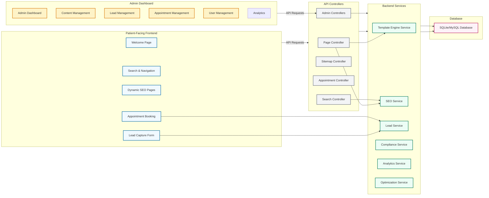
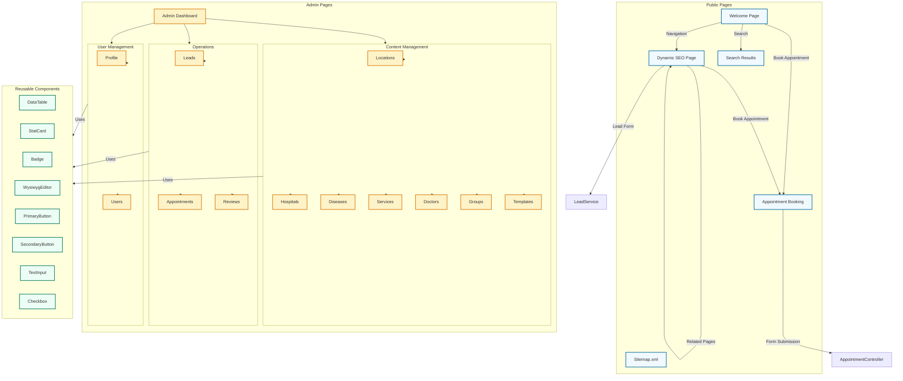
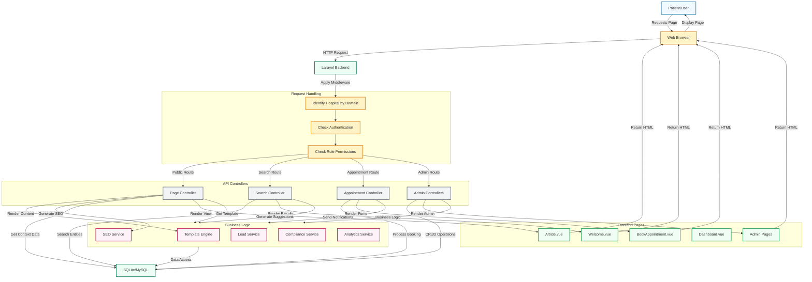

# Blik_eye Project - Comprehensive Visual Diagrams

## 1. Database Diagram (Enhanced ER Diagram)

```mermaid
erDiagram
    USER {
        id PK
        name string
        email string
        phone string
        password string
        role string
        hospital_id int
        created_at datetime
        updated_at datetime
    }
    
    HOSPITAL {
        id PK
        name string
        domain string
        subdomain string
        email string
        phone string
        location_id int
        lat decimal
        lng decimal
        image string
        is_active boolean
        created_at datetime
        updated_at datetime
    }
    
    LOCATION {
        id PK
        parent_id int
        type string
        name string
        slug string
        lat decimal
        lng decimal
        pincode string
        population int
        seo_priority int
        is_active boolean
        image string
        created_at datetime
        updated_at datetime
    }
    
    DISEASE {
        id PK
        name string
        slug string
        description text
        image string
        is_active boolean
        created_at datetime
        updated_at datetime
    }
    
    SERVICE {
        id PK
        name string
        slug string
        description text
        image string
        is_active boolean
        created_at datetime
        updated_at datetime
    }
    
    DOCTOR {
        id PK
        name string
        specialty string
        bio text
        hospital_id int
        image string
        slug string
        is_active boolean
        created_at datetime
        updated_at datetime
    }
    
    LEAD {
        id PK
        hospital_id int
        disease_id int
        location_id int
        name string
        phone string
        source_url text
        campaign_type string
        status string
        created_at datetime
        updated_at datetime
    }
    
    APPOINTMENT {
        id PK
        user_id int
        hospital_id int
        doctor_id int
        appointment_date date
        appointment_time time
        patient_name string
        patient_phone string
        patient_email string
        notes text
        reason string
        status string
        created_at datetime
        updated_at datetime
    }
    
    BLOG {
        id PK
        title_template string
        content_template longtext
        slug_template string
        tenant_id int
        is_active boolean
        created_at datetime
        updated_at datetime
    }
    
    GROUP {
        id PK
        name string
        type string
        is_active boolean
        created_at datetime
        updated_at datetime
    }
    
    GROUP_ITEM {
        id PK
        group_id int
        item_id int
        item_type string
        created_at datetime
        updated_at datetime
    }
    
    REVIEW {
        id PK
        hospital_id int
        author_name string
        rating int
        content text
        source string
        created_at datetime
        updated_at datetime
    }
    
    HOSPITAL_GALLERY {
        id PK
        hospital_id int
        image_path string
        created_at datetime
        updated_at datetime
    }
    
    SERVICE_GALLERY {
        id PK
        service_id int
        image_path string
        created_at datetime
        updated_at datetime
    }
    
    DISEASE_GALLERY {
        id PK
        disease_id int
        image_path string
        created_at datetime
        updated_at datetime
    }
    
    BLOG_GALLERY {
        id PK
        blog_id int
        image_path string
        created_at datetime
        updated_at datetime
    }
    
    USER ||--o{ APPOINTMENT : has
    HOSPITAL ||--o{ USER : "hospital manager"
    HOSPITAL ||--o{ DOCTOR : employs
    HOSPITAL ||--o{ LEAD : captures
    HOSPITAL ||--o{ APPOINTMENT : schedules
    HOSPITAL ||--o{ REVIEW : "has reviews"
    LOCATION ||--o{ HOSPITAL : "has location"
    LOCATION ||--o{ LOCATION : parent
    DISEASE ||--o{ LEAD : "related to"
    LOCATION ||--o{ LEAD : "from location"
    GROUP ||--|{ GROUP_ITEM : contains
    GROUP_ITEM }|--|| DISEASE : "morphed"
    GROUP_ITEM }|--|| SERVICE : "morphed"
    GROUP_ITEM }|--|| LOCATION : "morphed"
    GROUP ||--o{ BLOG : "used by"
    HOSPITAL ||--o{ BLOG : "tenant owner"
    HOSPITAL ||--o{ HOSPITAL_GALLERY : "has gallery"
    SERVICE ||--o{ SERVICE_GALLERY : "has gallery"
    DISEASE ||--o{ DISEASE_GALLERY : "has gallery"
    BLOG ||--o{ BLOG_GALLERY : "has gallery"
    DOCTOR ||--o{ APPOINTMENT : "schedules"
```

## 2. Feature Interconnections Diagram



## 3. Front-end Wireframe Diagram



## 4. Project Flow Diagram



## Diagram Summary

### 1. Database Diagram (Enhanced ER Diagram)
- Comprehensive view of all 14 database tables with their relationships
- Includes newly added `REVIEW` table for patient reviews
- Shows polymorphic relationships through GROUP_ITEM table
- Highlights hierarchical location structure and multi-tenant architecture
- Includes all necessary fields and timestamps

### 2. Feature Interconnections Diagram
- Shows how different features/modules interact within the system
- Clearly separates frontend, admin panel, services, controllers, and database
- Highlights key service dependencies and data flow
- Visualizes API request paths from both public and admin interfaces

### 3. Front-end Wireframe Diagram
- Maps out all public and admin pages with navigation structure
- Shows reusable components used across the application
- Highlights content management, operations, and user management sections
- Provides a clear overview of the UI hierarchy

### 4. Project Flow Diagram
- High-level system flow from user interaction to backend processing
- Shows middleware chain (hospital identification, authentication, authorization)
- Details how controllers handle different route types
- Visualizes the full request-response cycle through services and database
- Highlights which frontend views are rendered for each request type

All diagrams are created using Mermaid syntax for easy viewing and editing, following the project's architecture and requirements. They provide a comprehensive visual representation of the Blik_eye system, making it easier to understand and maintain.
