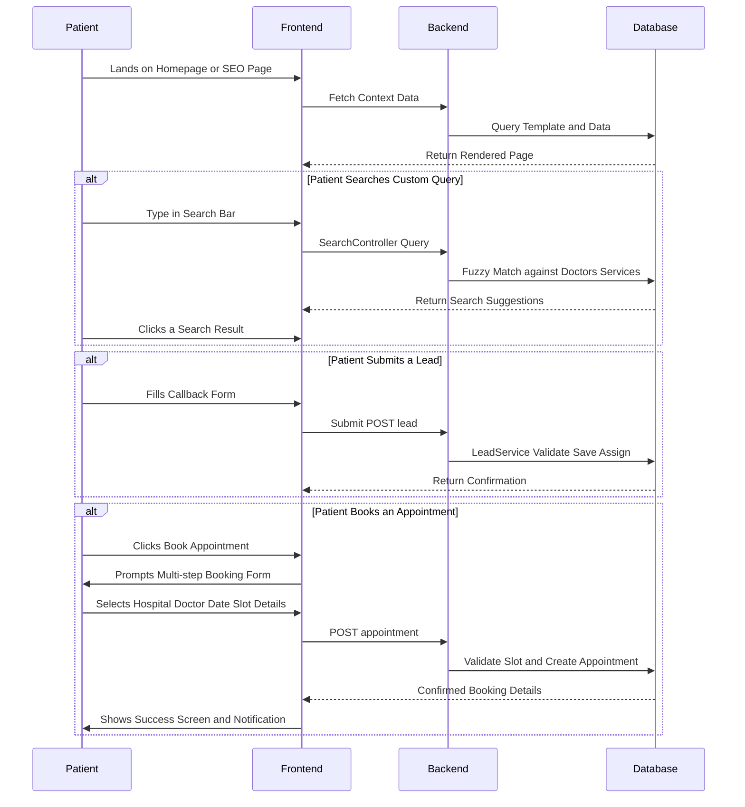
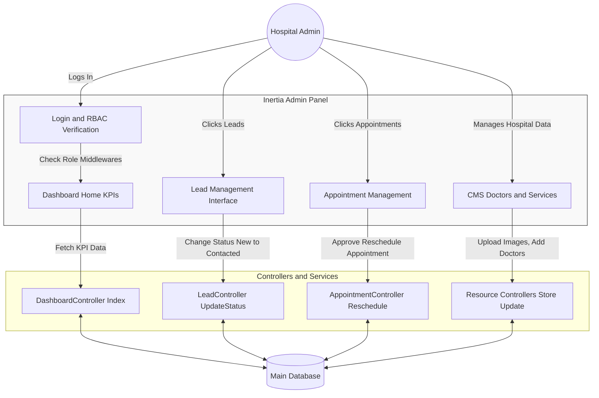
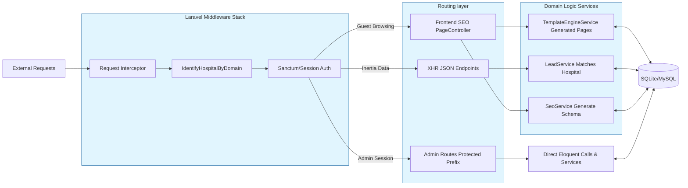

# Project Implementation Working Flows (Wireframes)

Based on the actual implementation of Blik_eye, here are the detailed "working wireframes" (flow diagrams) that illustrate how the different personas and the core project system operate.

## 1. Patient Working Flow (Front-End Journey)

This diagram represents the step-by-step working of a Patient on the platform.

---

## 2. Admin Working Flow (Dashboard Operations)

This diagram outlines how Hospital Managers and Super Admins manage the day-to-day operations.

---

## 3. Overall Project Implementation Flow (System Architecture)

This diagram shows the "under the hood" working of the project, detailing how Laravel intercepts and routes different domains.

---

### Summary of the Implementation Workings:

1. **Patient Working:** Revolves around consumption of dynamically rendered templates (SEO Pages), using search features, and converting via Lead Capture forms or the Multi-step Appointment Booking form.
2. **Admin Working:** Focused purely on operational CRUD. Admins authenticate, are scoped to their specific `hospital_id` via middleware, and clear queues by updating statuses for Leads and Appointments.
3. **Project Execution:** Operates on a multi-tenant middleware pattern. Every request checks the domain/subdomain, scaffolds the context, applies the right CMS templates, handles the database queries using Eloquent ORM, and formats the return payload via Inertia to Vue 3.
